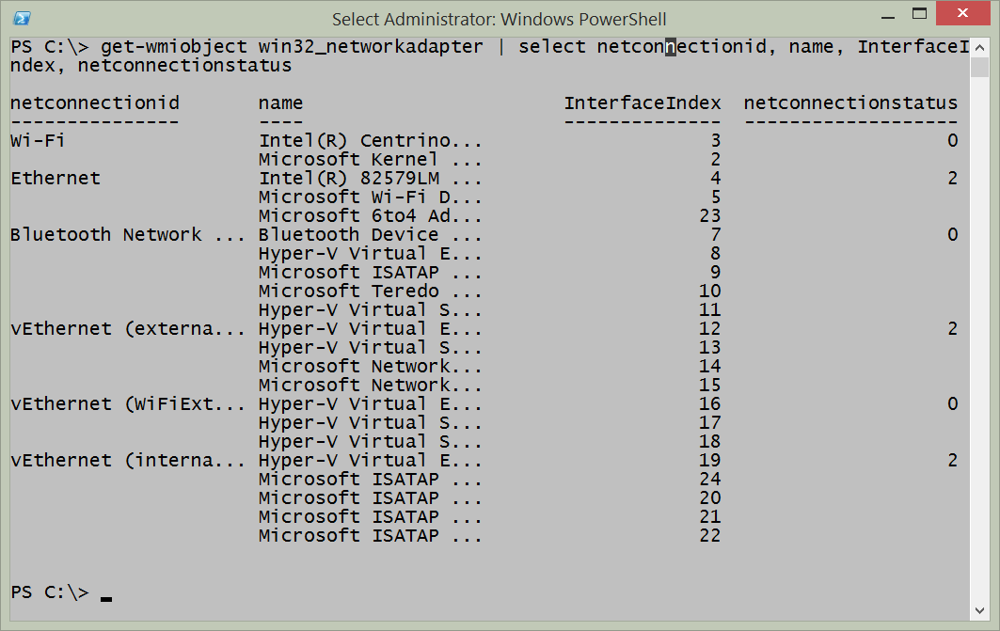
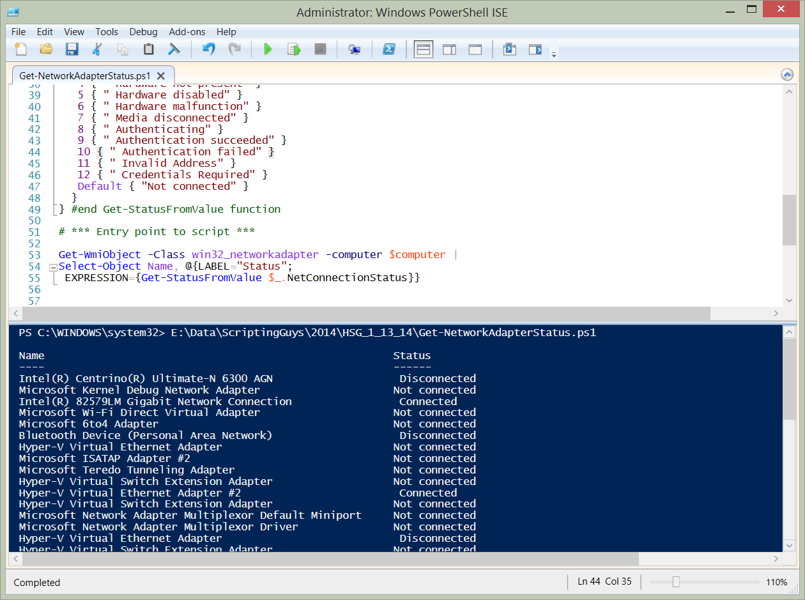
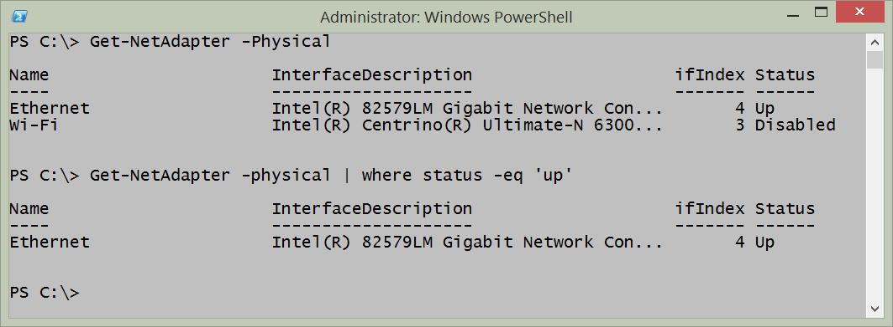

# Finding connected network adapters
One of the most fundamental pieces of troubleshooting or security checks to do is to find out which of the many network adapters on a computer are actually connected to a network.

**PowerTip** : Show 'up' physical adapters

Question: You want to see which physical network adapters on your Windows 8.1 computer using Windows PowerShell. How can you do this?

Answer: Use the -physical parameter with the Get-NetAdapter function and filter for a status of up. This technique appears here: 
````
Get-NetAdapter -physical| where status -eq 'up'
````
## Using NetSh

It is pretty easy to use NetSh to retrieve information about the connection status of network adapters. To do so, I use the following command:
````
netsh interface ipv4 show interfaces
````
One of the problems, from a management perspective, is that the command returns text. Therefore, if I need to parse the text to pull out specific information, such as the Interface Index number, or the Name of the adapter, then I am going to have to resort to writing a complicated regular expression pattern. If all I need to do is to obtain the information because I am writing to a log file as text, then the command works great, and is the lowest common denominator - I can use it all the way back to Windows 2000 days.

I can even run the netsh commands from within the Windows PowerShell console. This appears in the figure that follows.


## Using WMI

It is possible to use WMI and the Win32\_NetworkAdapter WMI class to retrieve information about the connection status. The NetConnectionStatus property reports backed in a coded value that reports the status. These values are documented on [MSDN for the Win32\_NetworkAdapter class](http://msdn.microsoft.com/en-us/library/aa394216%28v=vs.85%29.aspx). Using the Get-WmiObject Windows PowerShell cmdlet, I can work with any operating system that installs Windows PowerShell. This includes Windows XP, Windows Server 2003 and above. The following command returns information similar to the NetSh command.
````
get-wmiobject win32\_networkadapter|select netconnectionid, name, InterfaceIndex, netconnectionstatus
````
The command and the output from the command appear in the figure that follows.
````

````
The difference is that instead of plain text, the command returns objects that can be further manipulated. Therefore, while the above command actually returns the network connection status of all network adapters, the NetSh command only returns the ones that are connected. If I filter on a netconnectionstatus of 2 I can return only the connected network adapters. The command becomes this one (this is a single line command that I broke at the pipeline character for readability):
````
get-wmiobject win32\_networkadapter -filter "netconnectionstatus = 2"|

selectnetconnectionid,name,InterfaceIndex,netconnectionstatus
````
The command and output appear in the figure that follows.


If the desire is to obtain the connection status of more than just network adapters that are connected, then the task will require writing a script to do a lookup. The lookup values appear in the table that follows:

| **Value** | **Meaning** |
| --- | --- |
| 0 | Disconnected |
| 1 | Connecting |
| 2 | Connected |
| 3 | Disconnecting |
| 4 | Hardware not present |
| 5 | Hardware disabled |
| 6 | Hardware malfunction |
| 7 | Media disconnected |
| 8 | Authenticating |
| 9 | Authentication succeeded |
| 10 | Authentication failed |
| 11 | Invalid Address |
| 12 | Credentials required |

The Get-NetworkAdapterStatus.ps1 script requires at least Windows PowerShell 2.0 which means that it will run on Windows XP SP3 and above.

**Get-NetworkAdapterStatus.Ps1**
````
<#

 .Synopsis
  Produces a listing of network adapters and status on a local or remote machine.

 .Description
  This script produces a listing of network adapters and status on a local or remote machine.

 .Example
  Get-NetworkAdapterStatus.ps1 -computer MunichServer
  Lists all the network adapters and status on a computer named MunichServer

 .Example
  Get-NetworkAdapterStatus.ps1
  Lists all the network adapters and status on local computer

 .Inputs
  [string]

 .OutPuts
  [string]

 .Notes
  NAME: Get-NetworkAdapterStatus.ps1

  AUTHOR: Ed Wilson

  LASTEDIT: 1/10/2014

  KEYWORDS: Hardware, Network Adapter

 .Link

  Http://www.ScriptingGuys.com

#Requires -Version 2.0

#>

Param(
 [string]$computer=$env:COMPUTERNAME
) #end param

functionGet-StatusFromValue
{
Param($SV)
switch($SV)
 {
 0 { " Disconnected" }
 1 { " Connecting" }
 2 { " Connected" }
 3 { " Disconnecting" }
 4 { " Hardware not present" }
 5 { " Hardware disabled" }
 6 { " Hardware malfunction" }
 7 { " Media disconnected" }
 8 { " Authenticating" }
 9 { " Authentication succeeded" }
 10 { " Authentication failed" }
 11 { " Invalid Address" }
 12 { " Credentials Required" }
 Default { "Not connected" }
 }

} #end Get-StatusFromValue function

# \*\*\* Entry point to script \*\*\*

Get-WmiObject-Classwin32\_networkadapter-computer$computer|
Select-ObjectName, @{LABEL="Status";

EXPRESSION={Get-StatusFromValue$\_.NetConnectionStatus}}
````
If my environment is Windows 7 and Windows Server 2008 R2, I can use either Windows PowerShell 3.0 or Windows PowerShell 4.0. The advantage here, is that I gain access to the Get-CimInstance cmdlet which uses WinRM for remoting instead of DCOM that the Get-WmiObject cmdlet uses. The only change to the Get-NetworkAdapterStatus.ps1 script that is required is to replace the Get-WmiObject line with Get-CimInstance. The revision appears here:
````
# \*\*\* Entry point to script \*\*\*

Get-CimInstance-Classwin32\_networkadapter-computer$computer|
Select-ObjectName, @{LABEL="Status";

EXPRESSION={Get-StatusFromValue$\_.NetConnectionStatus}}
````
When I run the Get-StatusFromValue.ps1 script, in the Windows PowerShell ISE, I see the output achieved here.



## Using the NetAdapter module

On Windows 8 and above the NetAdapter module contains the Get-NetAdapter function. To see the status of all network adapters, use the Get-NetAdapter function with no parameters. The command appears here:
````
Get-NetAdapter
````
The output from this command appears here.


I can reduce the output to only physical adapters by using the -physical parameter. This command appears here.
````
Get-NetAdapter-Physical
````
If I only want to see the physical network adapters that are actually up, I pipeline the results to the where-object. This command appears here.
````
Get-NetAdapter-physical|wherestatus-eq'up'
````
The commands and the output from the two previous commands appear in the figure that follows.




