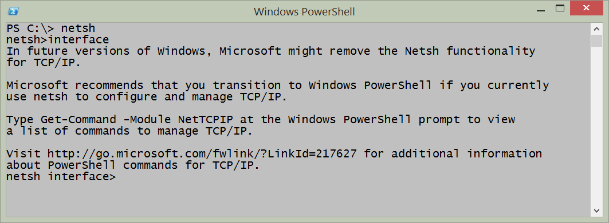
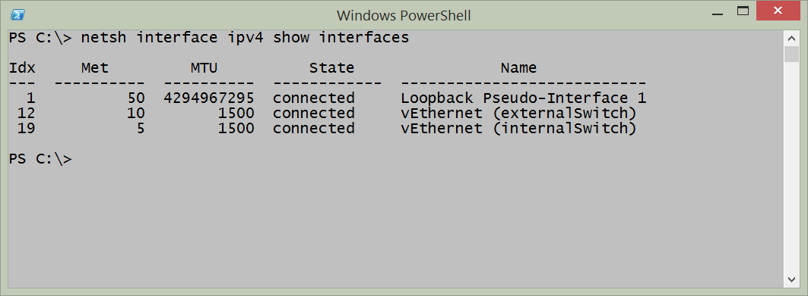
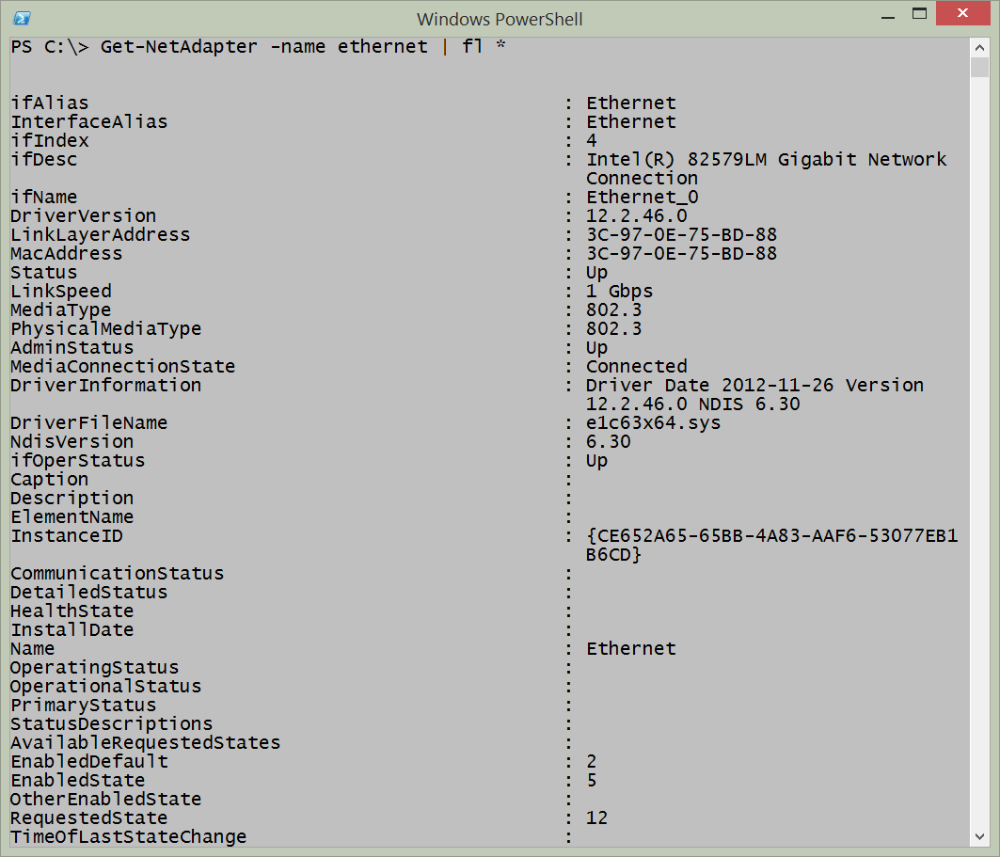
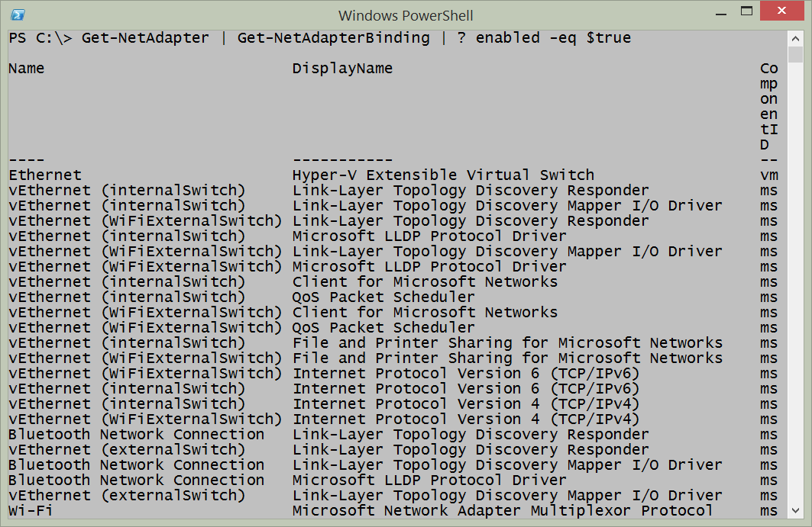
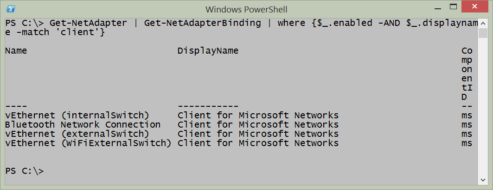

# Identifying network adapters
One of the great things about Windows Management Instrumentation (WMI) is the way that it can provide detailed information. The bad thing is that it requires a specialist level of knowledge and understanding to effectively use and to understand the information (either that or a good search engine, such as [BING](http://www.bing.com/) and an awesome repository of information such as the [Script Center](http://technet.microsoft.com/en-us/scriptcenter)).

## Using raw WMI to identify network adapters

One of the cool things about Windows PowerShell, since version 1.0, is that it provides easier access to WMI information. The bad thing, of course, is that it is still wrestling with WMI, which some IT Pro's seem to hate (or at least dislike). The great thing about using raw WMI is compatibility with older versions of the operating system. For example, using raw WMI and Windows PowerShell would make it possible to talk to Windows XP, Windows 2003 Server, Windows 2008 Server, Vista, Windows Server 2008 R2 and Windows 7, in addition to the modern operating systems of Windows 8, 8.1 and Windows Server 2012 and Windows Server 2012 R2.

So how do I do it? I used to be able to find our real network card by finding the one that was bound to TCP/IP. I would query the Win32\_NetworkAdapterConfiguration WMI class, and filter on the IPEnabled property. Using this approach, I would have done something like this:
```
 Get-WmiObject-ClassWin32\_NetworkAdapterConfiguration -filter"IPEnabled = $true"
```
The problem with this methodology nowadays is that some of the pseudo adapters are also IPEnabled. The above command would eliminate many, but not necessarily all of the adapters.

A better approach is to look at the Win32\_NetworkAdapter class and query the NetConnectionStatus property. Using this technique, I return only network adapter devices that are actually connected to a network. While it is possible that a pseudo adapter could sneak under the wire, the likelihood is more remote. In this command, I will use the Get-WmiObject PowerShell cmdlet to return all instances of Win32\_NetworkAdapter class on the computer. I then create a table to display the data returned by the NetConnectionStatus property.
```
Get-WmiObject-ClassWin32\_NetworkAdapter|
Format-Table-PropertyName,NetConnectionStatus-AutoSize
```
The fruit of our labor is somewhat impressive. I have a nice table that details all of the fake and real network adapters on our laptop, as well as the connection status of each. Here is the list from my laptop.
```
Name                       NetConnectionStatus

----                       -------------------

WAN Miniport (L2TP)
WAN Miniport (PPTP)
WAN Miniport (PPPOE)
WAN Miniport (IPv6)
Intel(R) PRO/1000 PL Network Connection     2
Intel(R) PRO/Wireless 3945ABG Network Connection 0
WAN Miniport (IP)
Microsoft 6to4 Adapter
Bluetooth Personal Area Network
RAS Async Adapter
isatap.{51AAF9FF-857A-4460-9F17-92F7626DC420}
Virtual Machine Network Services Driver
Microsoft ISATAP Adapter
Bluetooth Device (Personal Area Network)     7
6TO4 Adapter
Microsoft 6to4 Adapter
Microsoft Windows Mobile Remote Adapter
isatap.launchmodem.com
isatap.{647A0048-DF48-4E4D-B07B-2AE0995B269F}
Microsoft Windows Mobile Remote Adapter
WAN Miniport (SSTP)
WAN Miniport (Network Monitor)
6TO4 Adapter
6TO4 Adapter
Microsoft 6to4 Adapter
Microsoft Windows Mobile Remote Adapter
isatap.{C210F3A1-6EAC-4308-9311-69EADBA00A04}
isatap.launchmodem.com
Virtual Machine Network Services Driver
Virtual Machine Network Services Driver
Teredo Tunneling Pseudo-Interface
isatap.{647A0048-DF48-4E4D-B07B-2AE0995B269F}
```
There are two things you will no doubt notice. The first is that most of the network adapters report no status what-so-ever. The second thing you will notice is that the ones that do report a status do so in some kind of code. The previous table is therefore pretty much useless! But it does look nice.

A little work in the Windows SDK looking up the Win32\_NetworkAdapter WMI class and I run across the following information:
```
Value Meaning

0     Disconnected

1     Connecting

2     Connected

3     Disconnecting

4     Hardware not present

5     Hardware disabled

6     Hardware malfunction

7     Media disconnected

8     Authenticating

9     Authentication succeeded

10    Authentication failed

11    Invalid address

12    Credentials required
```
The value of 2 means the network adapter is connected. Here is the code I wrote to exploit the results of our research.
```
Get-WmiObject -classwin32\_networkadapter -filter "NetConnectionStatus = 2"|
Format-List -Property [a-z]\*
```
Such ecstasy is short lived; however, when I realize that while I have indeed returned information about a network adapter that is connected, I do not have any of the configuration information from the card.

What I need is to be able to use the NetConnectionStatus property from Win32\_Networkadapter and to be able to obtain the Tcp/Ip configuration information from the Win32\_NetworkAdapterConfiguration WMI class. This sounds like a job for an association class. In VBScript querying an Association class involved performing confusing AssociatorsOf queries (Refer to the MSPress book, " [Window Scripting with WMI: Self Paced Learning Guide](http://www.amazon.com/Microsoft%C2%AE-Windows%C2%AE-Scripting-WMI-Self-Paced/dp/0735622310/ref=sr_1_1?ie=UTF8&qid=1389289441&sr=8-1&keywords=ed+wilson+wmi)" for more information about this technique.)

Using the association class with Windows PowerShell, I come up with the FilterAssociatedNetworkAdapters.ps1 script shown here.

__FilterAssociatedNetworkAdapters.ps1__
```
Param($computer="localhost")

functionfunline ($strIN)
{
$num=$strIN.length
for($i=1 ; $i-le$num ; $i++)
 { $funline=$funline+"=" }
  Write-Host-ForegroundColoryellow$strIN
  Write-Host-ForegroundColordarkYellow$funline
} #end funline

Write-Host-ForegroundColorcyan"Network adapter settings on $computer"

Get-WmiObject -Class win32\_NetworkAdapterSetting `
-computername $computer|
Foreach-object `
{
 If( ([wmi]$\_.element).netconnectionstatus -eq 2)
  {
  funline("Adapter: $($\_.setting)")
  [wmi]$\_.setting
  [wmi]$\_.element
  } #end if
} #end foreach
```
I begin the script by using a command line parameter to allow us to run the script remotely if needed. I use the Param statement to do this. I also create a function named funline that is used to underline the results of the query. It makes the output nicer if there is a large amount of data returned.
```
Param($computer="localhost")

functionfunline ($strIN)
{
$num=$strIN.length
for($i=1 ; $i-le$num ; $i++)
 { $funline=$funline+"=" }
  Write-Host-ForegroundColoryellow$strIN
  Write-Host-ForegroundColordarkYellow$funline
} #end funline
```
I print out the name of the computer by using the Write-Host cmdlet as seen here. I use the color cyan so the text will show up real nice on the screen (unless of course your background is also cyan, then the output will be written in invisible ink. That might be cool as well.)
```
Write-Host -Foreground Colorcyan "Network adapter settings on $computer"
```
Then I get down to actual WMI query. To do this, I use the Get-WmiObject cmdlet. I use the -computername parameter to allow the script to run against other computers, and I pipeline the results to the ForEach-Object cmdlet.
```
Get-WmiObject -Class win32\_NetworkAdapterSetting `
-computername $computer|
Foreach-object `
```
The hard part of the query is seen here. I need a way to look at the netConnectionStatus property of the Win32\_NetworkAdapter class. This class is referred to by the reference returned from the association query. It is called element. To gain access to this class, I use the reference that was returned and feed it to the [WMI] type accelerator (it likes to receive a path, and this is what the reference is). Since the reference refers to a specific instance of a WMI class, and since the [WMI] type accelerator can query a specific instance of a class, I are now able to obtain the value of the netConenctionStatus property. So I say in our script, if it is equal to 2, then I will print out the name of the network adapter, and the configuration that is held in the setting property and the adapter information that held in the element property. This section of the code is seen here.
```
{
 If( ([wmi]$\_.element).netconnectionstatus -eq2)
  {
  funline("Adapter: $($\_.setting)")
  [wmi]$\_.setting
  [wmi]$\_.element
  } #end if
```
The result of running the script is that it displays information from both the Win32\_NetworkAdapter WMI class and the Win32\_NetworkAdapterConfiguration class. It also shows us I only have one connected network adapter.

## Using NetSh

Microsoft created NetSh back in 2000, and it has been a staple of networking ever since then. When I open it up, now days, it displays a message saying that it might be removed in future versions of Windows, and therefore I should begin using Windows PowerShell. Here is the message:



Now, because NetSh is an old style menu type application, it is possible to enter NetSh, and walk my way down through the menus until you arrive at the proper location. Along the way, if I get lost, I can use the ? to obtain help. The problem, is that the help is quite often not very helpful, and therefore it takes me at times nearly a dozen times before the command is correct. The great thing is that, for the most part, Once I figure out a command, I can actually keep track of my location in the program, and back all the way out and enter the command as a one linner. Here is the NetSh command to display network interface information that is bound to Ipv4:
```
netsh interface ipv4 show interfaces
```
The output appears here:



## Using PowerShell on Windows 8 or above

If I have the advantage of Windows 8 or 8.1 or Windows Server 2012 or Windows Server 2012 R2, then I have the built in NetAdapter module. Due to the way that modules autoload on Windows Powell I do not need to remember that I am using functions that exist in the NetAdapter module. I can use either Windows PowerShell 3 or Windows PowerShell 4 and the behavior will be the same (Windows 8.1 and Windows Server 2012 R2 come with Windows PowerShell 4 and Windows 8 and Windows Server 2012 come with Windows PowerShell 3).

The Get-NetAdapter cmdlet returns the name, interface description, index number, and status of all network adapters present on the system. This is the default display of information and appears in the figure that follows.


To focus in on a particular network adapter, I use the _name _parameter and supply the name of the network adapter. The good thing, is that in Windows 8 (and on Windows Server 2012) the network connections receive new names. No more of the "local area connection" and "local area connection(2) to attempt to demystify. The wired network adapter is simply _Ethernet _and the wireless network adapter is _Wi-Fi. _The following command retrieves only then _Ethernet _network adapter.
```
Get-NetAdapter -Name Ethernet
```
To dive into the details of the _Ethernet _network adapter, I pipeline the returned object to the Format-List cmdlet and I choose all of the properties. The command appearing here uses the _fl _alias for the Format-List cmdlet.
```
Get-NetAdapter -Name ethernet|Format-List *
```
The command and output associated with the command appear in the figure that follows.



There are a number of excellent properties that might bear further investigation, for example there are the _adminstatus _and the _mediaconnectionstatus _properties. The following command returns those two properties.
```
Get-NetAdapter -Name ethernet |select adminstatus, MediaConnectionState
```
Of course, there are other properties that might be interesting as well. These properties appear here, along with the associated output (the following is a single logical command broken on two lines).
```
Get-NetAdapter -Name ethernet |
select ifname, adminstatus, MediaConnectionState, LinkSpeed, PhysicalMediaType
```
The output from the above command appears here:
```
ifName        : Ethernet\_7
AdminStatus     : Down
MediaConnectionState : Unknown
LinkSpeed      : 0 bps
PhysicalMediaType  : 802.3
```
I decide to look only for network adapters that are in the admin status of _up. _I use the command appearing here.
```
PS C:\> Get-NetAdapter|whereadminstatus-eq"up"

Name           InterfaceDescription          ifIndex Status
----           --------------------          ------- ------
vEthernet (InternalSwi... Hyper-V Virtual Ethernet Adapter #3     22 Up
vEthernet (ExternalSwi... Hyper-V Virtual Ethernet Adapter #2     19 Up
Bluetooth Network Conn... Bluetooth Device (Personal Area Netw...   15 Disconn...
Wi-Fi           Intel(R) Centrino(R) Ultimate-N 6300...   12 Up
```
To find the disabled network adapters, I change the _adminstatus _from _up _to _down. _This command appears here.
```
Get-NetAdapter|whereadminstatus-eq"down"
```
I go back to my previous command, and modify it to return WI-FI information. This command, and associated output appears here (this is a single logical command).
```
PS C:\> Get-NetAdapter-Name wi-fi|
select ifname,adminstatus,MediaConnectionState,LinkSpeed,PhysicalMediaType

ifName        : WiFi\_0
AdminStatus     : Up
MediaConnectionState : Connected
LinkSpeed      : 54 Mbps
PhysicalMediaType  : Native 802.11
```
If I want to find any network adapters sniffing the network, I look for _promiscousmode. _This command appears here.
```
Get-NetAdapter| ? PromiscuousMode -eq $true
```
When I combine the Get-NetAdapter function with the Get-NetAdapterBinding function I can easily find out which protocols are bound to which network adapter. I just send the results to the Where-Object and check to see if the enabled property is equal to true or not. Here is the command.
```
Get-NetAdapter |Get-NetAdapterBinding | ? enabled -eq $true
```
Here is an example of both the command and the output from the command.



If I want to find which network adapters have the Client for Microsoft Networks bound, I need to first see which protocols are enabled (using the syntax from the previous command) and I need to see which one of the enabled protocols have the display name of Client for Microsoft Networks. This requires a compound where-object statement and therefore I cannot use the simplified syntax. Also, because only one of the protocols begins with Client - I can use that to shorten my query just a bit. Here is the command I use (this is a one line command that I broke at the pipe character to make a better display).
```
Get-NetAdapter |
Get-NetAdapterBinding |
where {$\_.enabled -AND$\_.displayname -match 'client'}
```
The command and associated output appear in the figure here.




